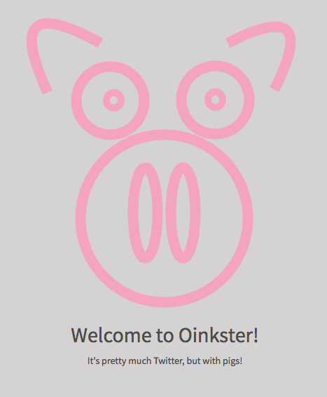

# Oinkster

##### This is a web app meant to offer the same basic functionality that Twitter does.

<center></center>

### App features

Currently the app's features include:
- A front end built with `React.js`/`Redux`
- A `Node.js/Express` RESTful API
- A `PostgreSQL` database
- Authentication with JSON web tokens
- Tests written with `mocha`, `chai`, `enzyme`, and `supertest`
- User image uploading to AWS S3 with the AWS API

To be implemented:
- "hashtag" and "following" features
- Analyze some of the data with natural language processing APIs
- Graph app data with `D3.js` or `chart.js`
- Integrate social authentication with `Auth0`


### Development
- Use `Node 7.2`
  - `nvm use` if using `nvm`
- make sure `postgres` is running on port `5432` with database name `oinkster-dev`
- `npm install`
- `gulp`
- `node webpack-dev-server.js`
- app will run at `localhost:8080`
- need following `config` directory:

```
 config
 ├─── morgan
 │   └─── index.js
 |   └─── config.dev.js
 ├─── db-config.js
```
with the files:

`morgan/index.js`
```
var env = process.env.NODE_ENV || 'dev';
var config = require('./config.' + env + '.js');

module.exports = config;
```

`morgan/config.dev.js`
```
module.exports = {
  format: 'dev',
  options: null
};
```
`db-config.js`
```
module.exports = {
  connection: {
    host: 'localhost',
    port: 5432,
    user: 'you',
    database: 'oinkster-dev'
  }
}
```
